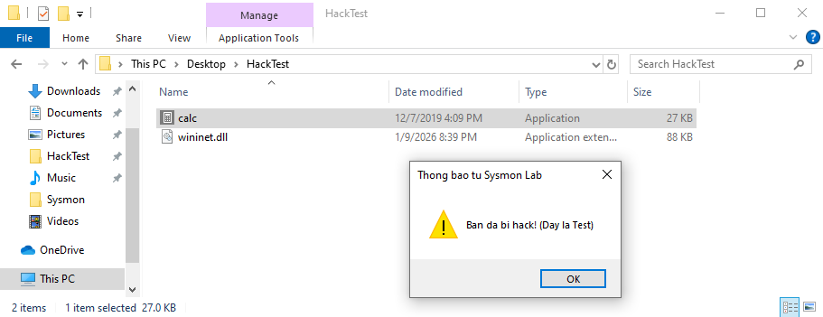
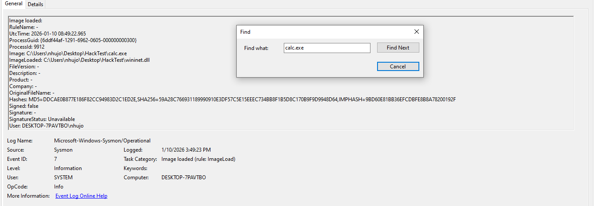

# Project 01: DLL Hijacking Detection with Sysmon

## 1. Objective
The goal of this project is to simulate a **DLL Hijacking** attack technique (MITRE ATT&CK T1574.002) and develop a detection strategy using **Sysmon** logs. 

Understanding this technique is crucial for a SOC Analyst because attackers often use it to establish persistence or escalate privileges by forcing a legitimate application to load a malicious DLL.

## 2. Environment Setup
* **OS:** Windows 10/11 Virtual Machine.
* **Monitoring Tool:** Sysmon (configured with SwiftOnSecurity config).
* **Analysis Tool:** Windows Event Viewer / Event Log Explorer.
* **Attack Tools:** * Vulnerable Application: `calc.exe` (copied from System32).
    * Payload: A custom DLL renamed to `WININET.dll`.

## 3. Attack Simulation (Red Team)
I performed the following steps to simulate the attack:
1.  Copied `calc.exe` from `C:\Windows\System32` to a user-writable directory (`C:\Users\Admin\Desktop\Test_Lab`).
2.  Created a "fake" DLL and renamed it to `WININET.dll`.
3.  Placed the malicious DLL in the same folder as `calc.exe`.
4.  Executed `calc.exe`.

**Result:** Instead of opening the calculator normally, the application loaded my local DLL due to the *DLL Search Order* vulnerability.



## 4. Log Analysis (Blue Team)
After the execution, I analyzed **Sysmon Event ID 7 (Image Loaded)** to investigate the behavior.

### Key Observations:
* **Process:** `calc.exe`
* **Image Loaded:** `WININET.dll`
* **Path Mismatch:** The legitimate `WININET.dll` should be loaded from `C:\Windows\System32\`. However, the logs show it was loaded from `C:\Users\Admin\Desktop\Test_Lab\`.
* **Signature Status:** The malicious DLL is unsigned (or signed by an untrusted entity), whereas the original system DLL is signed by Microsoft.

**Evidence from Event Viewer:**


## 5. Detection Strategy & IOCs
Based on the analysis, here are the Indicators of Compromise (IOCs) and the logic to detect this threat.

### Indicators of Compromise (IOCs)
| Indicator Type | Value | Context |
| :--- | :--- | :--- |
| **Filename** | `WININET.dll` | Loaded from non-system directory |
| **Parent Process** | `calc.exe` | Running from non-system directory |
| **Event ID** | Sysmon 7 | Image Load Event |

### Detection Logic (Pseudo-Rule)
To detect this activity in a SIEM (like Splunk or ELK), we can use the following logic:

```text
IF (EventID == 7) AND 
   (ImageLoaded ENDS WITH "WININET.dll") AND 
   (ImageLoaded DOES NOT START WITH "C:\Windows\System32\") AND
   (Signed == "false")
THEN
   TRIGGER ALERT "Potential DLL Hijacking Detected"
```
## 6. Conclusion
This lab demonstrated how standard Windows applications can be tricked into loading malicious code. By monitoring **Image Load events (Event ID 7)** and validating the **file path** and **digital signature**, a SOC Analyst can effectively detect DLL Hijacking attempts.
