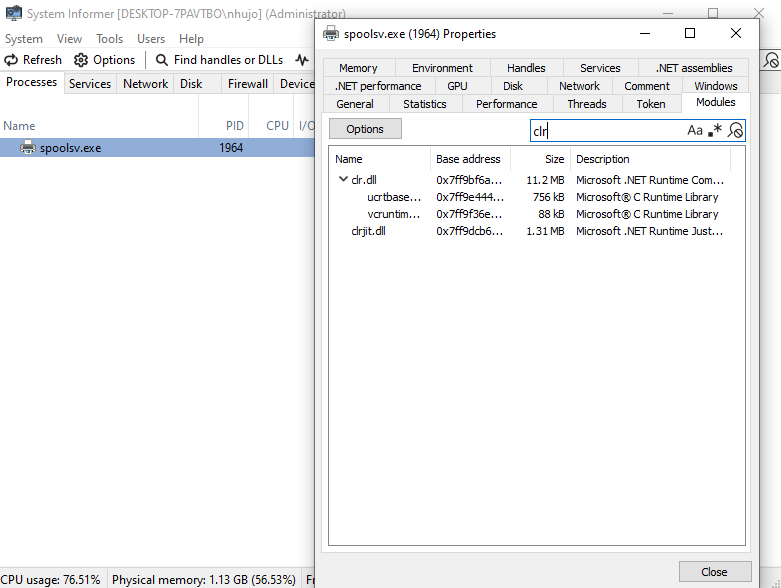
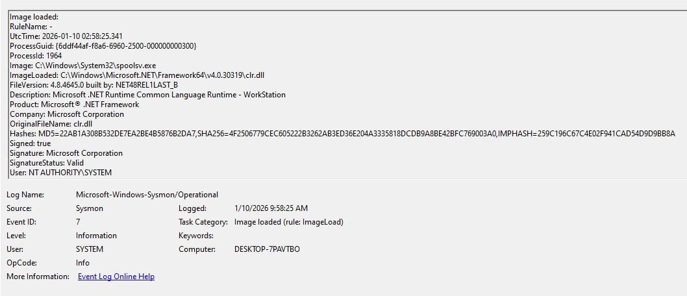

# Project 02: Detect Unmanaged PowerShell/C# Injection

## 1. Objective
The goal of this project is to simulate and detect a **Process Injection** attack (MITRE ATT&CK T1055). Specifically, I focused on "Unmanaged PowerShell" injection, where attackers run malicious .NET (C#) code inside a legitimate, unmanaged Windows process to evade detection.

This technique is dangerous because the malicious code runs entirely in memory (fileless malware) and "piggybacks" on a trusted system process.

## 2. Environment Setup
* **Target Machine:** Windows 10/11 Virtual Machine.
* **Monitoring Tools:** * **Sysmon** (Event ID 7).
    * **Process Hacker 2** (To visualize managed/unmanaged processes).
* **Attack Tool:** `Invoke-PSInject.ps1` 
* **Target Process:** `spoolsv.exe` 

## 3. Attack Simulation (Red Team)
I performed the injection using a PowerShell script to inject a base64 encoded payload into the target process.

**Steps:**
1.  Launched a legitimate process: `notepad.exe` (or used an existing service like `spoolsv`).
2.  Used `Invoke-PSInject` to inject code into the target Process ID (PID).
    * *Command:* `Invoke-PSInject -ProcId [PID] -PoshCode "V3JpdGUtSG9zdCAiSGVsbG8sIEd1cnU5OSEi"` (Decodes to "Hello, Guru99!").
3.  Observed the behavior in Process Hacker.

**Result:** The target process (`spoolsv.exe`), which is normally an **Unmanaged** (native) application, suddenly transformed into a **Managed** (.NET) application.



## 4. Log Analysis (Blue Team)
Since the attack happens in memory, standard file scanning might miss it. However, **Sysmon Event ID 7 (Image Loaded)** captures the libraries loaded by the process.

### Key Observations:
* **Process:** `spoolsv.exe` (The victim process).
* **Abnormal Image Loads:**
    * `clr.dll` (Common Language Runtime)
    * `clrjit.dll`
    * `Microsoft.PowerShell.ConsoleHost.dll` (or related .NET assemblies)
    
**Analysis:** Native Windows processes like `spoolsv.exe` or `notepad.exe` are written in C/C++ and **should not** load the .NET Runtime (`clr.dll`) under normal circumstances. The presence of these DLLs indicates that foreign .NET code was injected and executed.

**Evidence from Event Viewer:**


## 5. Detection Strategy
To detect this In-Memory attack, we look for "Managed" DLLs loading into "Unmanaged" processes.

### IOCs (Indicators of Compromise)
| Indicator | Value | Context |
| :--- | :--- | :--- |
| **Event ID** | Sysmon 7 | Image Load |
| **ImageLoaded** | `*\\clr.dll`, `*\\clrjit.dll` | The .NET Runtime libraries |
| **Image (Process)** | `spoolsv.exe`, `notepad.exe`, `svchost.exe` | Processes that shouldn't use .NET |

### Detection Logic (Pseudo-Rule)
```text
IF (EventID == 7) AND
   (ImageLoaded ENDS WITH "clr.dll" OR "clrjit.dll") AND
   (Image IS_IN_LIST ["notepad.exe", "spoolsv.exe", "calc.exe"])
THEN
   TRIGGER ALERT "Potential Process Injection (.NET in Native Process)"
```
## 6. Conclusion
Process Injection is a stealthy technique, but it leaves forensic artifacts. By monitoring for the **unexpected loading of the .NET Runtime (CLR)** in standard Windows processes, we can identify potential unmanaged PowerShell attacks or C2 beacons (like Cobalt Strike's execute-assembly).