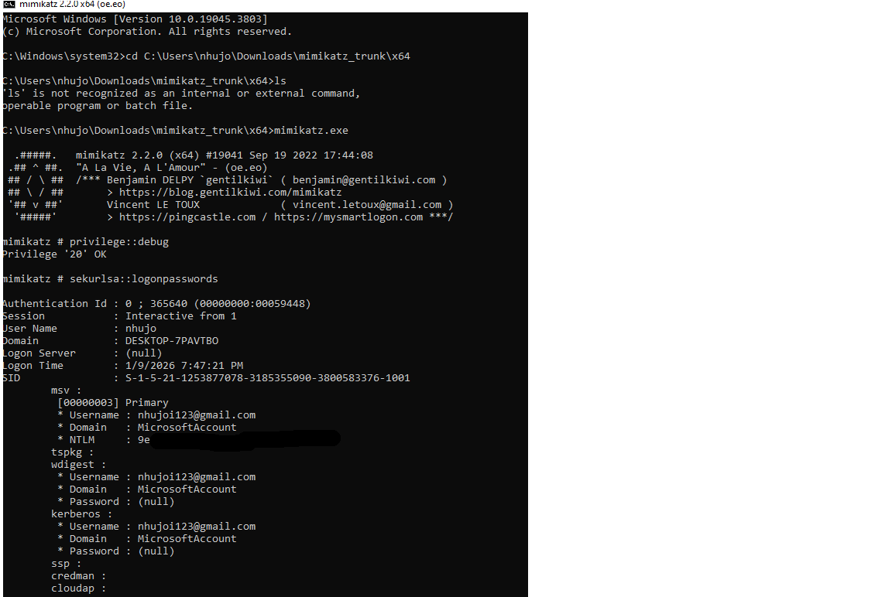
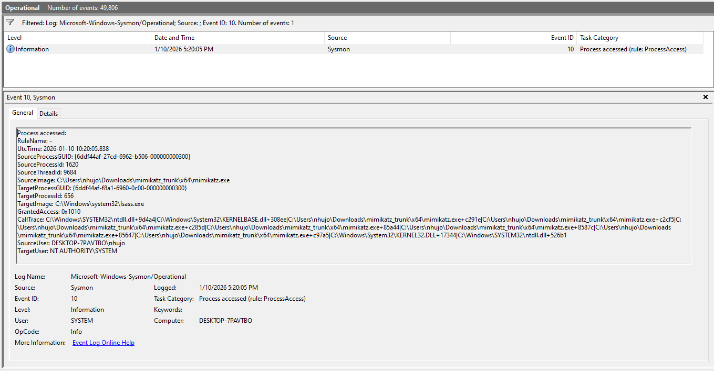

# Project 03: Detect LSASS Credential Dumping (Mimikatz)

## 1. Objective
The goal of this project is to detect attempts to dump cleartext passwords and NTLM hashes from memory using **Mimikatz** (MITRE ATT&CK T1003.001 - OS Credential Dumping: LSASS Memory).

The **Local Security Authority Subsystem Service (LSASS)** is the "holy grail" for attackers because it stores active user credentials. If an attacker accesses this process, they can steal identities and move laterally across the network.

## 2. Environment Setup
* **Target Machine:** Windows 10/11 Virtual Machine.
* **Security Settings:** **Windows Defender Real-time Protection DISABLED** (Critical: Defender will delete Mimikatz immediately upon download).
* **Monitoring Tool:** Sysmon (Event ID 10 - Process Access).
* **Attack Tool:** `mimikatz.exe` (Run with Administrator privileges).

## 3. Attack Simulation (Red Team)
I performed the credential dumping using the standard Mimikatz commands:

**Steps:**
1.  Open Command Prompt as **Administrator**.
2.  Run `mimikatz.exe`.
3.  Execute: `privilege::debug` (To enable SeDebugPrivilege, allowing interaction with system processes).
4.  Execute: `sekurlsa::logonpasswords` (To extract credentials from LSASS).

**Result:** Mimikatz successfully dumped the NTLM hashes and (in some cases) cleartext passwords of the logged-in user.



## 4. Log Analysis (Blue Team)
Mimikatz works by opening a "Handle" to the `lsass.exe` process to read its memory. Sysmon **Event ID 10 (ProcessAccessed)** records this specific interaction.

### Key Observations:
* **TargetImage:** `C:\Windows\system32\lsass.exe` (The victim).
* **SourceImage:** `C:\Tools\mimikatz.exe` (The attacker).
* **GrantedAccess:** `0x1010` or `0x1410`.
    * This is the technical signature. `0x1010` corresponds to `PROCESS_QUERY_LIMITED_INFORMATION | PROCESS_VM_READ`. This specific combination of access rights is required to read the memory of another process.

**Evidence from Event Viewer:**
!

## 5. Detection Strategy
Detecting Mimikatz by filename is easy but ineffective (attackers can rename it to `notepad.exe`). A robust detection relies on the **behavior** of accessing LSASS with specific permissions.


### IOCs (Indicators of Compromise)
| Indicator | Value | Context |
| :--- | :--- | :--- |
| **Event ID** | Sysmon 10 | Process Access |
| **Target Image** | `lsass.exe` | The process being touched |
| **GrantedAccess** | `0x1010`, `0x1410`, `0x143a` | Specific flags used to read memory |
| **CallTrace** | (Contains unknown/unsigned DLLs) | Advanced detection method |

### Detection Logic (Pseudo-Rule)
```text
IF (EventID == 10) AND
   (TargetImage ENDS WITH "lsass.exe") AND
   (GrantedAccess == "0x1010" OR "0x1410") AND
   (SourceImage IS NOT IN Whitelist ["mpcmdrun.exe", "msmpeng.exe"])
THEN
   TRIGGER ALERT "Suspicious Access to LSASS (Potential Credential Dumping)"
```
## 6. Conclusion
Protecting `lsass.exe` is critical. By monitoring **Event ID 10**, we can detect unauthorized processes attempting to read memory from LSASS, regardless of what the attacker names their tool.