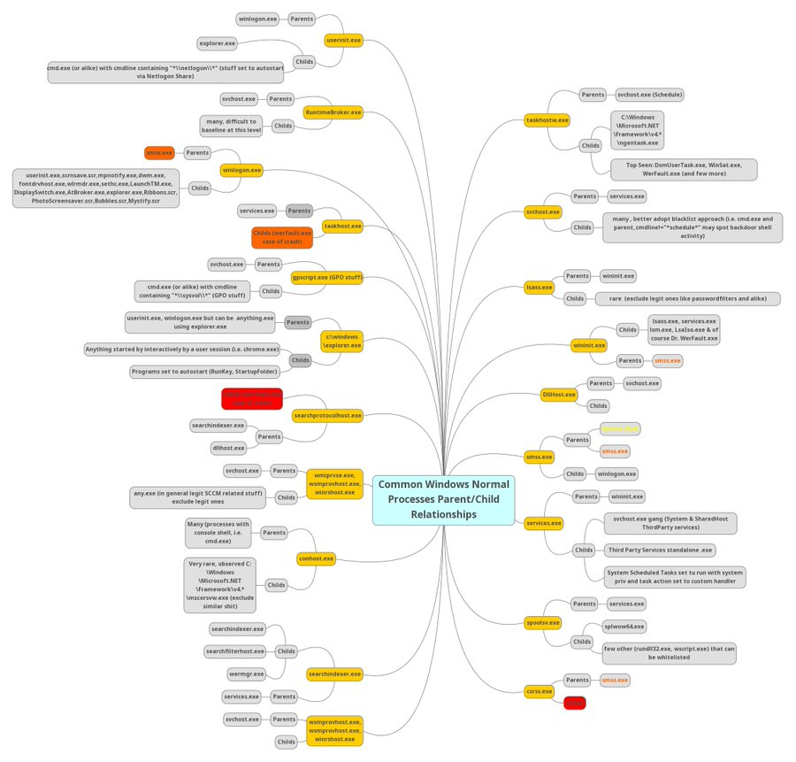
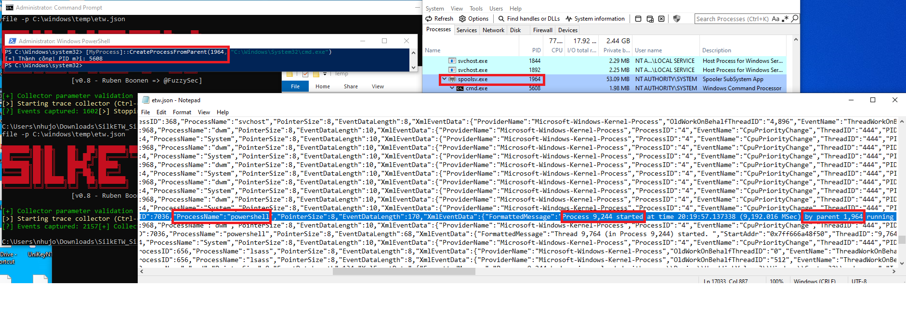
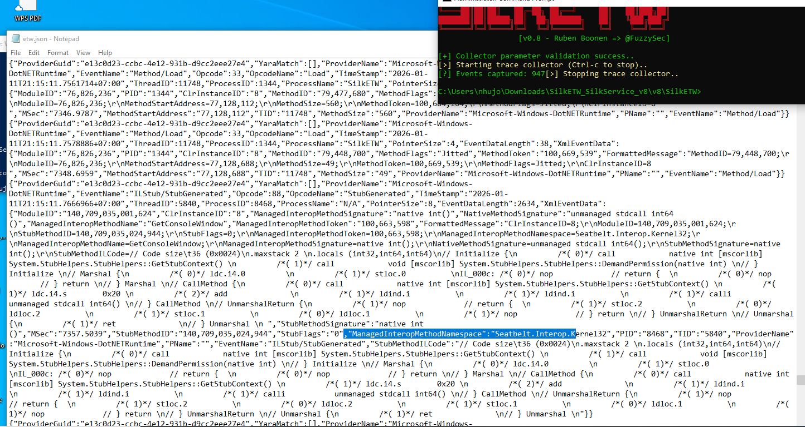

# Project 04: Advanced Threat Hunting with ETW (Event Tracing for Windows)

## 1. Objective
Sysmon is powerful, but sophisticated attackers can evade it or mislead it. This project explores **ETW (Event Tracing for Windows)** via **SilkETW** to detect advanced techniques that bypass standard logging:
1.  **Parent PID Spoofing:** Where attackers lie about who spawned a process.
2.  **Malicious .NET Execution:** Detecting "Bring Your Own Land" (BYOL) attacks where tools run in memory.

## 2. Scenario 1: Unmasking Parent PID Spoofing

### 🧠 Concept: The "Normal" Baseline
Before detecting anomalies, we must understand the standard parent-child relationships in Windows. 
The mind map below (by Samir Bousseaden) shows legitimate process lineage. For instance, `spoolsv.exe` typically spawns `splwow64.exe`, NOT `cmd.exe` or `powershell.exe`.

### 🕵️ The Attack: Parent PID Spoofing
Attackers use this technique to blend in. I used a script to spawn `cmd.exe` but lied to the OS that the parent was `spoolsv.exe`.

* **Anomaly:** According to the map above, `spoolsv.exe` -> `cmd.exe` is an invalid relationship.
* **Sysmon's Blindspot:** Sysmon Event 1 trusted the API and logged the fake parent.
* **ETW's Revelation:** ETW (Kernel level) revealed the true creator was `powershell.exe`.

## 3. Scenario 2: .NET Introspection (Seatbelt)
Detecting the execution of **Seatbelt** (a reconnaissance tool) by monitoring the `.NET Runtime`.

### Limitation of Sysmon
Sysmon Event ID 7 only showed `clr.dll` loading, which is generic behavior for any .NET app.

### ETW Visibility (DotNETRuntime Provider)
Using SilkETW with flags `0x2038` (JIT/Loader keywords), I captured specific method names like `Seatbelt` and `TokenPrivileges`, positively identifying the tool.

## 4. Conclusion
ETW provides a "source of truth" that is harder to tamper with than user-mode hooks. Integrating ETW data into a SIEM allows for high-fidelity detection of evasion techniques.